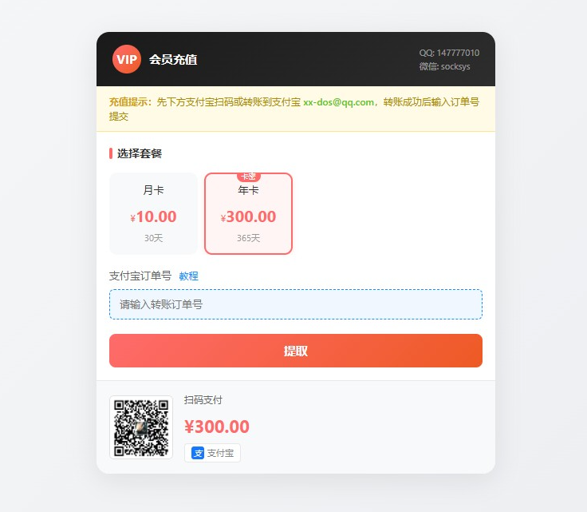
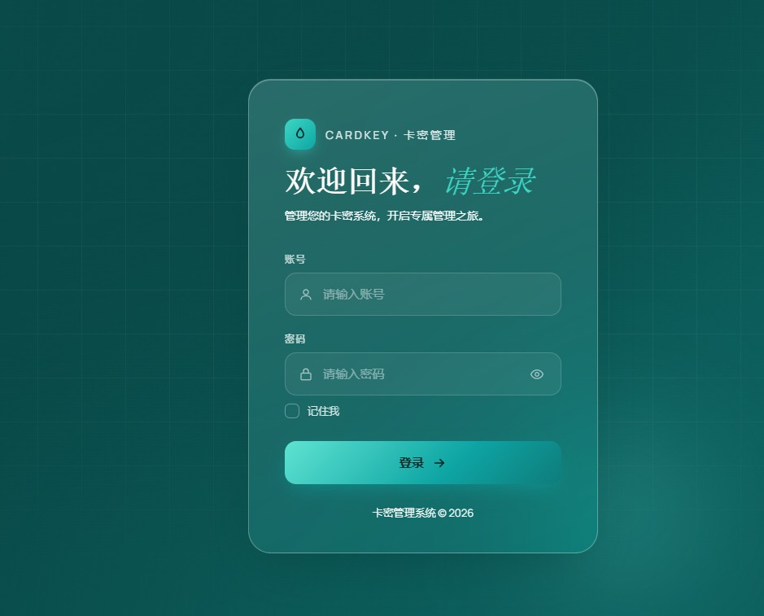
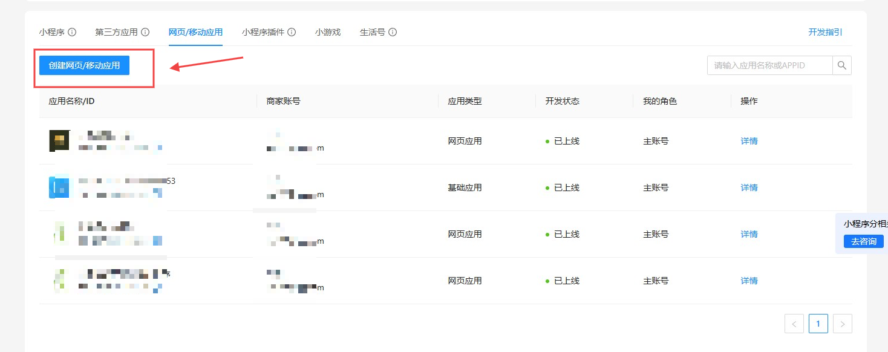
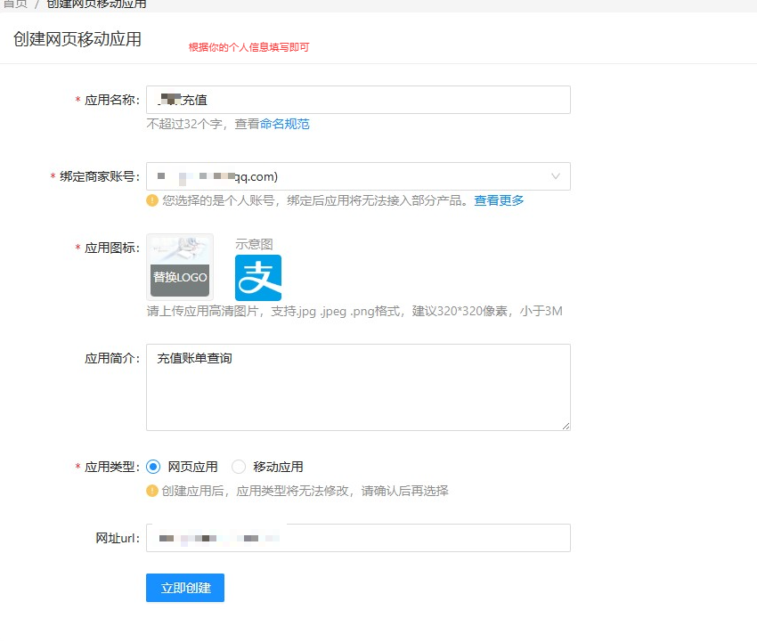
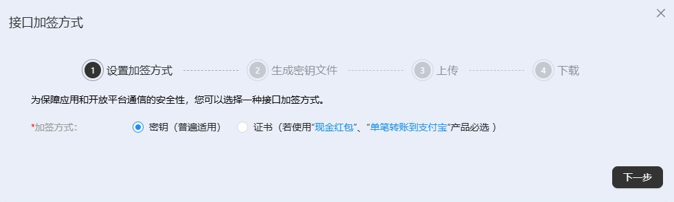
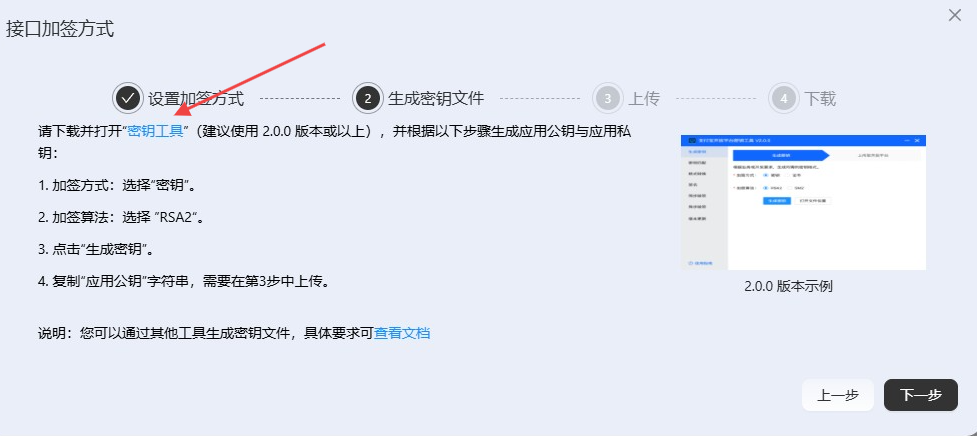
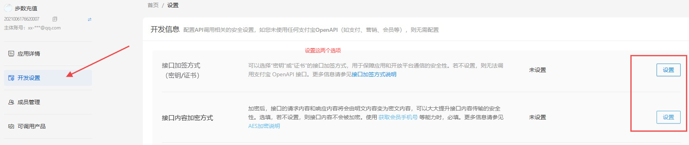
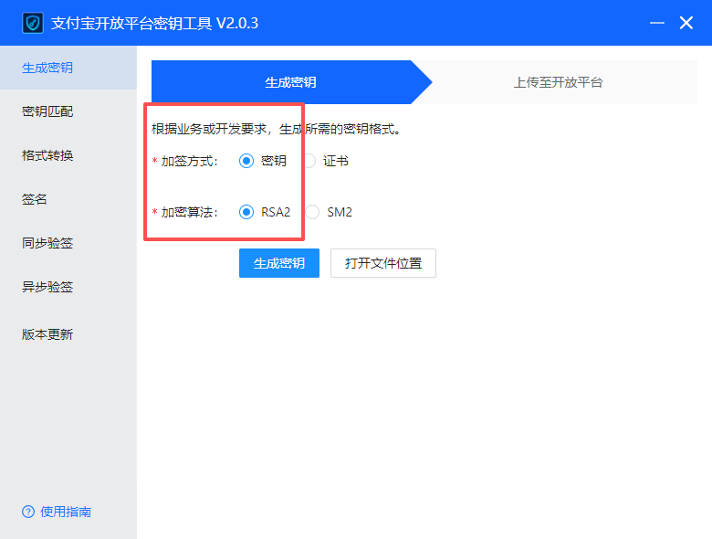
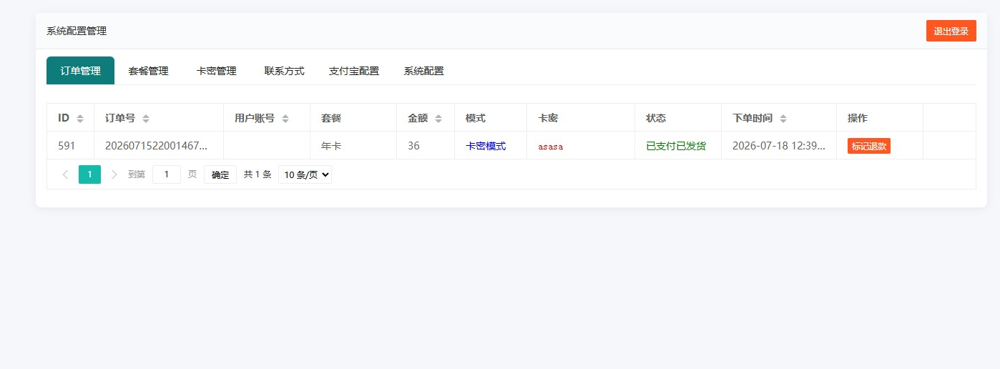
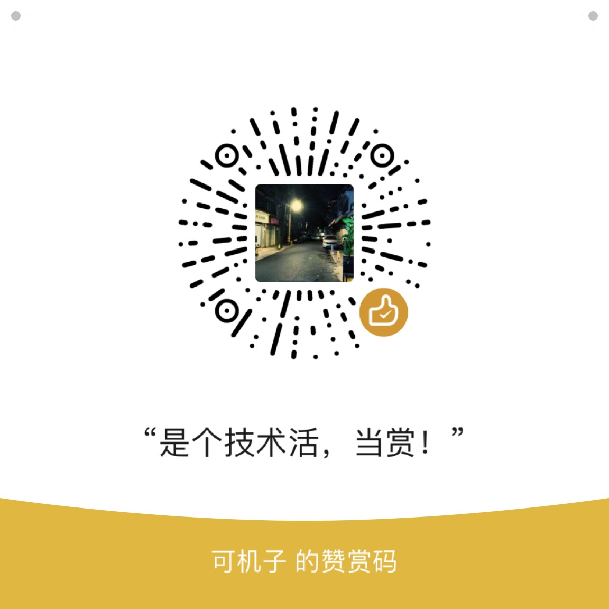

# 个人收款卡密管理系统 - 使用方法

## 项目概述

本系统是一个个人收款卡密管理系统，支持支付宝收款自动验证订单，并提供两种充值模式：

- **卡密模式**：用户支付后提取卡密
- **用户模式**：用户支付后更新会员有效期

### 充值页面预览



---

## 目录结构

```
pay2/
├── admin/                    # 后台管理界面
│   ├── admin.php            # 管理主页（登录后）
│   ├── admin_op.php         # 后台操作接口
│   └── index.php            # 登录页面
├── alipay/                  # 支付宝相关
│   └── alipay.php           # 支付宝账单查询接口
├── conn/                    # 数据库配置
│   └── db_conn.php          # 数据库连接配置（表名映射、字段映射）
├── img/                     # 图片资源
│   ├── Logo.ico             # 网站图标
│   ├── arrow_left.png       # 左箭头
│   ├── arrow_right.png      # 右箭头
│   ├── order.jpg            # 订单说明图
│   └── zfb.jpg              # 支付宝收款码
├── install/                 # 安装程序
│   ├── index.php            # 安装向导
│   ├── system_config.sql    # 系统配置表
│   ├── s_userinfo.sql       # 用户信息表
│   ├── s_order.sql          # 订单表
│   ├── recharge_plans.sql   # 充值套餐表
│   └── s_cards.sql          # 卡密表
├── src/                     # 静态资源
│   └── layui/               # layui 前端框架
├── MD/                      # 文档截图
├── add.php                  # 订单提交与处理接口
├── func.php                 # 公共函数库
├── index.php                # 前端充值页面
├── config.php               # 系统配置
└── README.md               # 本文件
```

---

## 安装步骤

### 1. 环境要求

- PHP 7.4+
- MySQL 5.7+
- 支持 SSL（用于支付宝接口）

### 2. 数据库配置

修改 `conn/db_conn.php` 文件，配置数据库连接信息：

```php
$db_host = "localhost";      // 数据库地址
$db_name = "your_database";  // 数据库名
$db_user = "your_username";  // 用户名
$db_pass = "your_password";  // 密码
$db_port = 3306;             // 端口
```

### 3. 运行安装向导

访问 `http://your-domain/install/`，按照向导步骤完成安装：

1. **环境检测**：检查 PHP 版本、MySQL 版本、数据库连接
2. **数据库导入**：点击导入按钮，系统自动执行 SQL 文件
3. **安装完成**：系统自动删除 install 目录

### 4. 登录后台

访问 `http://your-domain/admin/`，使用默认账号登录：

- **账号**：admin
- **密码**：admin

登录后请立即修改密码！

#### 后台登录页面



---

## 两种充值模式

### 1. 卡密模式（开箱即用）

无需修改代码，直接使用：

1. 在后台添加卡密套餐（设置 mode 为 card）
2. 在卡密管理中添加卡密数据
3. 用户支付后自动提取卡密

### 2. 用户模式（对接现有系统）

需要在现有用户表中增加字段：

1. 在你的用户表中添加 `mupdate` 字段，类型为 `datetime(0)`
2. 修改 `conn/db_conn.php` 中的配置：

```php
$_TB = array(
    "info" => "your_user_table"  // 改为你的用户表名
);

$_FIELD = array(
    "user" => "username",        // 改为你的用户名字段名
    "mupdate" => "mupdate"       // 会员到期时间字段名
);
```

3. 你的代码逻辑只需验证 `mupdate` 字段的到期时间即可

**注意**：系统默认的 `s_userinfo` 表是为纯卡密模式准备的，使用用户模式时无需理会该表。

---

## 支付宝配置

### 申请应用密钥

1. 打开 [https://open.alipay.com/](https://open.alipay.com/) 并登录


2. 点击右上角"控制台" → [https://open.alipay.com/develop/manage](https://open.alipay.com/develop/manage)


3. 点击"网页/移动应用"，创建应用

   
   
   
   
   
   

4. 设置相关密钥：
   - 下载官方密钥工具：[https://ideservice.alipay.com/ide/getPluginUrl.htm?clientType=assistant&platform=win&channelType=WEB](https://ideservice.alipay.com/ide/getPluginUrl.htm?clientType=assistant&platform=win&channelType=WEB)
   - 根据操作生成应用公私密钥，并保存好


   - 将生成的应用公钥上传后，保存支付宝公钥


5. 提交审核应用
6. 将应用私钥、支付宝公钥、应用ID上传至后台保存配置

### 后台配置

在后台"支付宝配置"中填写：

- **支付宝AppID**：应用的APP ID
- **应用私钥**：生成的应用私钥（纯文本，系统自动添加格式）
- **支付宝公钥**：支付宝平台提供的公钥
- **账单查询天数**：1-30天，默认30天

---

## 后台管理功能

### 后台管理页面



### 订单管理

- 查看所有订单记录
- 订单状态：待验证、已完成、已退款
- 支持标记订单为已退款

### 套餐管理

- 添加/编辑/删除充值套餐
- 设置套餐名称、价格、有效期（天）
- 设置套餐模式：user（用户模式）或 card（卡密模式）
- 套餐排序和启用/禁用

### 卡密管理

- 批量添加卡密
- 查看卡密使用状态
- 删除卡密

### 联系方式

- 设置支付宝收款邮箱
- 设置客服联系方式（QQ、微信等）

### 系统配置

- 修改管理员账号密码
- 设置 API 接口密钥

---

## 特别注意

1. **财产安全**：一个支付宝账号不要同时部署两套卡密系统，否则一个订单号可能被两个系统同时使用
2. **密码安全**：登录后请立即修改默认密码
3. **安装目录**：安装完成后系统会自动删除 install 目录，请确认删除成功
4. **数据备份**：定期备份数据库，防止数据丢失
5. **最小单位**：暂时默认最小单位为天，如果需要小时级别的有效期，可联系开发者更新

---

## 技术支持

如有问题，请联系作者：
- QQ: 147777010
- 微信: socksys